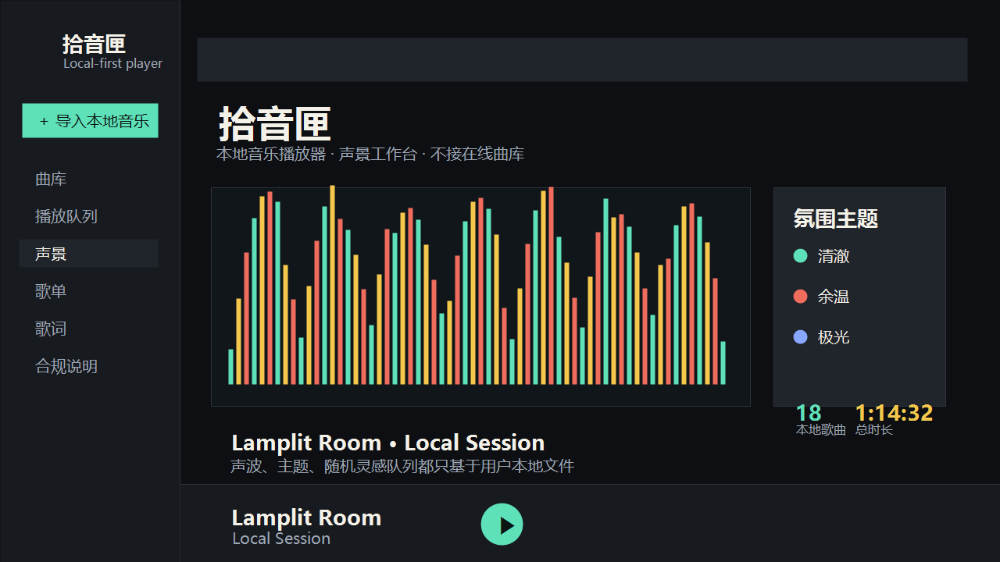

# 拾音匣

拾音匣 is an original, local-first web music player designed for public deployment without relying on third-party music platforms.



## What It Does

- Plays audio files that users select from their own device.
- Keeps playlists and lyrics in browser local storage.
- Provides an original soundscape workspace with audio visualization, mood themes, listening stats, and a random local mix builder.
- Includes a stage mode for a focused now-playing experience.
- Includes an optional podcast and radio view backed by public RSS feeds and public radio directories.
- Does not upload, cache, scrape private services, download, or distribute music files.
- Does not use any third-party music service API, code, name, icon, playlist, lyrics, video, account system, or private endpoint.

## Compliance Boundary

This project is intended to be a neutral player for files that the user owns or is licensed to use.

Do not deploy or modify it to:

- Connect to non-public music platform APIs.
- Offer copyrighted songs, lyrics, album art, or videos without authorization.
- Provide download, ripping, cache extraction, restricted-content access, or account automation features.
- Use names, logos, screenshots, or visual identity from third-party music services.
- Advertise the site as a replacement client for any official music platform.

For open-music results, always show source and license links. Do not remove attribution requirements from CC BY works.

## Podcast And Radio Proxy

The static site can run without a backend, but podcast search and RSS parsing need a small proxy because many RSS feeds block browser CORS requests.

1. Deploy `deno-proxy/main.ts` to Deno Deploy.
2. Copy the deployed URL.
3. Put it in `config.js`:

```js
window.SHIYIN_RADIO_PROXY_URL = "https://your-deno-project.deno.dev";
```

The proxy only returns public RSS episode audio links and public radio stream links. It does not store audio files or use private platform APIs.

No software project can guarantee absolute legal safety in every jurisdiction. For a public service, consult a qualified lawyer before adding online music sources or user-upload hosting.

## Publishing

This is a static site. You can deploy the folder to any static host:

- Netlify
- EdgeOne Pages
- GitHub Pages
- Cloudflare Pages
- any ordinary web server

The first screen is the player itself. No build step is required.

## Suggested Site Disclaimer

Use wording like this on the published site:

> 拾音匣 is an independent local music player. It is not affiliated with any third-party music service. Users are responsible for selecting only audio and lyric files they own or are authorized to use. This site does not provide online songs, downloads, account login, restricted-content access, or third-party service access.

## License

MIT. See `LICENSE`.
